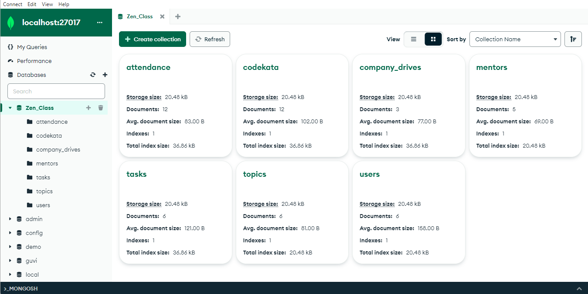

# MongoDB-Task2

It has Guvi-Zen class Roadmap session: Day-36 and Database : MongoDB : Day-4 Tasks. In this task, I learn to implement Intermediate to advanced level MongoDB Queries.

## Lessons Learned

- Aggregate
- $lookup
- $unwind
- $match
- $project
- $dateToString
- $sort
- $group
- $sum
  

## Screenshots

